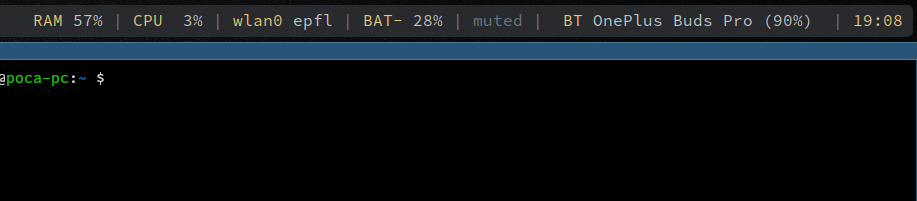

# Polybar Bluetooth Status

Bluetooth status module for Polybar, including:

* Support for enabling/disabling the bluetooth
* Auto-connect to saved devices list when enabling bluetooth 
* Showing the current device's name
* Showing the current device's battery level



## Usage

```sh
[module/bluetooth]
type = custom/script
exec = ~/.config/polybar/polybar-bluetooth-status/bluetooth.sh
interval = 2
click-left = exec ~/.config/polybar/polybar-bluetooth-status/toggle_bluetooth.sh
click-right = exec ~/.config/polybar/polybar-bluetooth-status/toggle_bluetooth.sh
format-padding = 1
format-prefix = "BT "
format-prefix-foreground = ${colors.primary}
label = %output%
```
